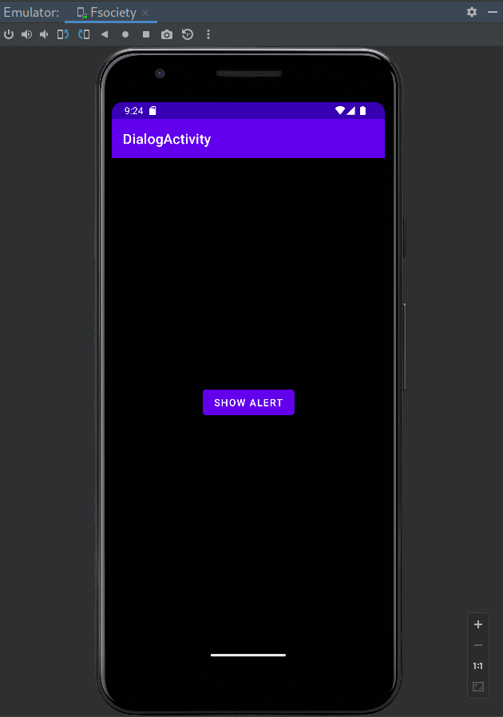
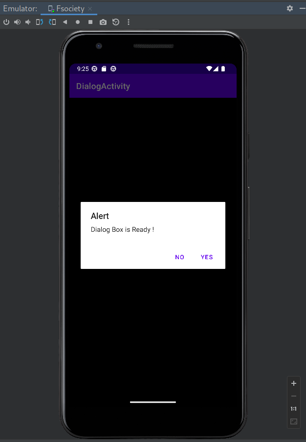

# The basic program to demonstrate Alert Dialog Activity in Android.

## MainActivity.java
```
    package com.example.dialogactivity;

    import android.annotation.SuppressLint;
    import android.os.Bundle;
    import android.widget.Button;
    import android.widget.Toast;

    import androidx.appcompat.app.AlertDialog;
    import androidx.appcompat.app.AppCompatActivity;

    public class MainActivity extends AppCompatActivity {


        Button btnAlert;
        @SuppressLint("MissingInflatedId")
        @Override
        protected void onCreate(Bundle savedInstanceState)
        {
            super.onCreate(savedInstanceState);
            setContentView(R.layout.activity_main);

            btnAlert = (Button) findViewById(R.id.btnAlert);
            btnAlert.setOnClickListener(view -> openAlertDialouge());
        }

        private void openAlertDialouge()
        {

            AlertDialog.Builder  builder = new AlertDialog.Builder(this);
            builder.setTitle("Alert");
            builder.setMessage("Dialog Box is Ready !");
            builder.setPositiveButton("Yes", (dialogInterface, i) -> Toast.makeText(this, "Positive button clicked", Toast.LENGTH_SHORT).show());

            builder.setNegativeButton("No", (dialogInterface, i) -> Toast.makeText(this, "negative button clicked", Toast.LENGTH_SHORT).show());

            AlertDialog alertDialog = builder.create();
            alertDialog.show();
        }
    }
```


## AndroidManifest.xml

```
<?xml version="1.0" encoding="utf-8"?>
<manifest xmlns:android="http://schemas.android.com/apk/res/android"
    xmlns:tools="http://schemas.android.com/tools">

    <application
        android:allowBackup="true"
        android:dataExtractionRules="@xml/data_extraction_rules"
        android:fullBackupContent="@xml/backup_rules"
        android:icon="@mipmap/ic_launcher"
        android:label="@string/app_name"
        android:roundIcon="@mipmap/ic_launcher_round"
        android:supportsRtl="true"
        android:theme="@style/Theme.DialogActivity"
        tools:targetApi="31">
        <activity
            android:name=".MainActivity"
            android:exported="true">
            <intent-filter>
                <action android:name="android.intent.action.MAIN" />

                <category android:name="android.intent.category.LAUNCHER" />
            </intent-filter>

            <meta-data
                android:name="android.app.lib_name"
                android:value="" />
        </activity>
    </application>

</manifest>
```


**Repo Link :** [DialogActivity](https://github.com/amanmullaofficial/DialogActivity)

OR

Import project as vcs from here :
>
https://github.com/amanmullaofficial/DialogActivity.git

Don't know how to import from VCS : [Click Here !](https://github.com/amanmullaofficial/Android_VCS)

### Project Snapshots





